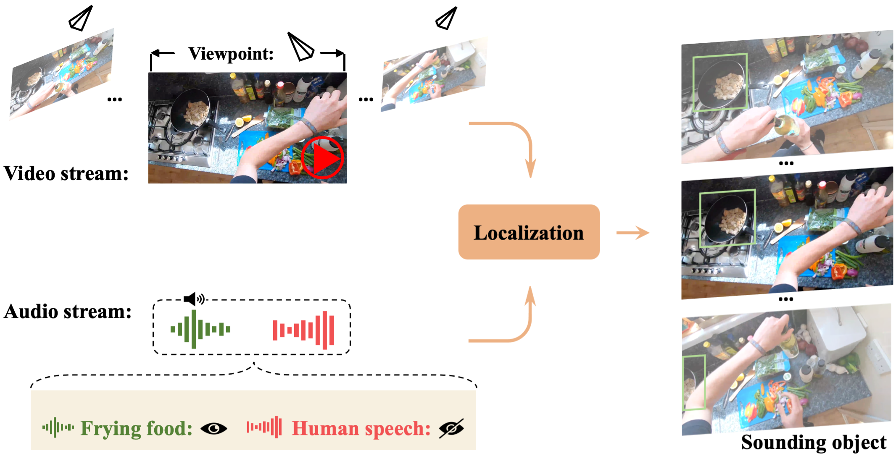

# Egocentric Audio-Visual Object Localization 
This is the PyTorch implementation of the paper "<a href="https://openaccess.thecvf.com/content/CVPR2023/papers/Huang_Egocentric_Audio-Visual_Object_Localization_CVPR_2023_paper.pdf">Egocentric Audio-Visual Object Localization</a>."
 
## Overview
<p align="center">
 
</p>

We explore the task of egocentric audio-visual object localization, which aims to localize objects that emit sounds in the first-person recordings. In this work, we propose a new framework to address the uniqueness of egocentric videos by answering the following two questions: (1) how to associate visual content with audio representations while out-of-view sounds may exist; (2) how to persistently associate audio features with visual content that are captured under different viewpoints.

* * *

## Epic Sounding Object dataset
Note, some videos are further filtered out and some bounding boxes are updated recently.

### Prepare Dataset
1. Download videos.

    a. Download Epic-Kitchens dataset from: https://epic-kitchens.github.io/2023 (The website provides scirt to download videos).

2. Preprocess videos. 

    a. Trim the video using Epic-Kitchens' original annotations, for example, the test video timestamps can be found at https://github.com/epic-kitchens/epic-kitchens-100-annotations/blob/master/EPIC_100_test_timestamps.csv.

    
    b. Extract waveforms at 11000Hz for all the videos.

3. Data splits. Please follow the same train/test splits at https://github.com/epic-kitchens/epic-kitchens-100-annotations.
4. Filter out silent clips. As the action recognition splits are developed based on action, not audio, there could be video clips that are silent or do not include meaningful sounds. We try to filter out some silent video clips to obtain a better training set, please refer to ```./code/script/filter_silent_clips.py```. (Optional, you can use the newly released <a href="https://epic-kitchens.github.io/epic-sounds/">EPIC-SOUND dataset</a> to obtain an audio-based training split) 

### Annotation Format
The annotations can be found at ```./data/soundingobject.json```.

  * `video` contains the index to locate the segment from a long video. For example, `P04_105-00:05:26.32-00:05:28.01-16316-16400` represents the `video_id,narration_timestamp,start_timestamp,stop_timestamp,start_frame,stop_frame` in the test split csv file.
* `frame` is the exact frame index we use to annotate the sounding object.
* `bbox` is the relative coordinates of bounding box, which is in `[left, top, right, bottom]` format.

* * *

## Requirements

```shell
pip install -r requirements.txt
```

* * *
## Training

1. Process videos and prepare the data. 
   a. Trim the video following https://github.com/epic-kitchens/epic-kitchens-100-annotations/blob/master/EPIC_100_train.csv and get the frames within [start_frame, stop_frame]. Store the data with the following directory structure

    ```
    folder_name (e.g., 'P01_01-00:00:00.14-00:00:03.37-8-202')
    ├── audio
    |   ├── P01_01-00:00:00.14-00:00:03.37-8-202.wav
    |
    └── rgb_frames
    |   ├── frame_0000000008.jpg
    │   ├── frame_0000000009.jpg
    │   ├── ...
    │   ├── frame_0000000202.jpg
    └──
    ```
    b. Create the index files `train.csv`. For each row, it stores the information: `participant_id,video_id,start_timestamp,stop_timestamp,start_frame,stop_frame,narration,folder_dir`. Note that you can change the format and revise the dataloader accordingly. An example is given as follows:
    ```
    participant_id, video_id, start_timestamp, stop_timestamp, start_frame, stop_frame, narration, folder_dir
    P01, P01_01, 00:00:00.14, 00:00:03.37, 8, 202, open door, /YOUR_DIR/P01_01-00:00:00.14-00:00:03.37-8-202-open_door  
    ```

2. Train the localization model
```
bash ./scripts/train_localization.sh
```

3. During training, checkpoints are saved to `data/ckpt/MODEL_ID`.


* * *

## Citation

If you find our work useful for your research, please consider citing our paper. :smile:

```
@inproceedings{huang2023egocentric,
  title={Egocentric Audio-Visual Object Localization},
  author={Huang, Chao and Tian, Yapeng and Kumar, Anurag and Xu, Chenliang},
  booktitle={Proceedings of the IEEE/CVF Conference on Computer Vision and Pattern Recognition},
  pages={22910--22921},
  year={2023}
}
```

### Acknowledgement
We borrowed a lot of code from [CCoL](https://github.com/YapengTian/CCOL-CVPR21/) and [CoSep](https://github.com/rhgao/co-separation). We thank the authors for sharing their code. If you use our codes, please also consider cite their nice works.
